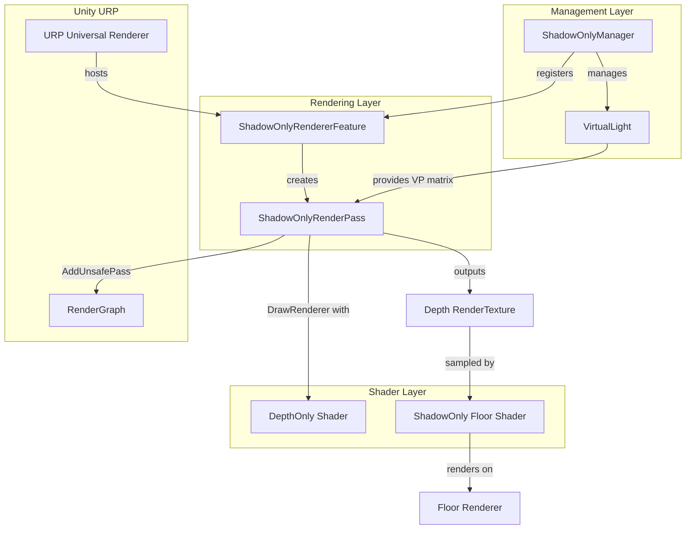
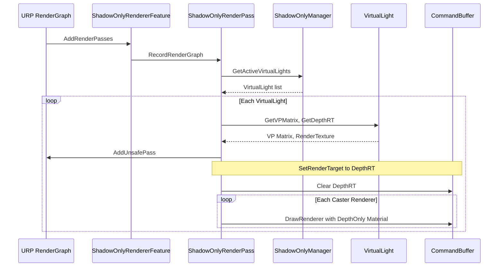
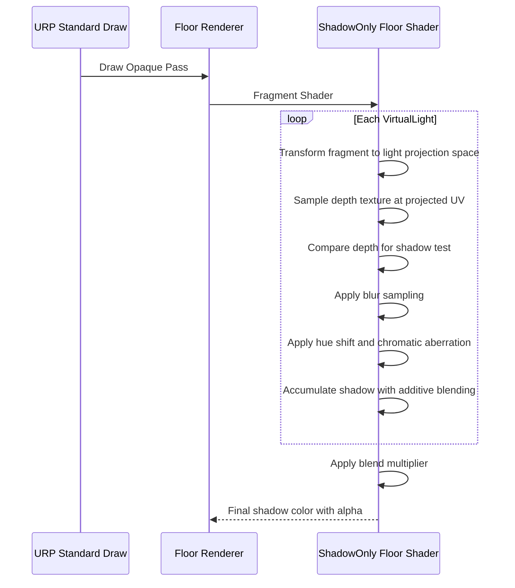
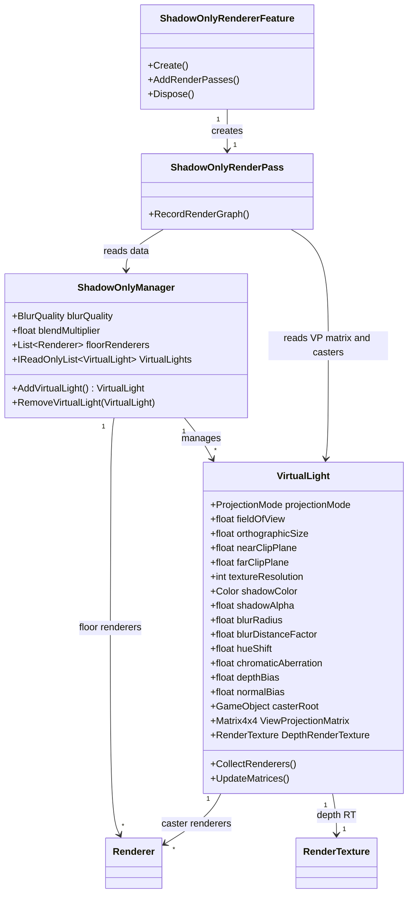

# Design Document

## Overview

**Purpose**: 本機能は、Unity URP (Universal Render Pipeline) 向けの「影だけを表示するシェーダー」システムを提供する。VTuber配信やキャラクターコンテンツ制作において、透明な床面上にキャラクターの影のみを描画し、任意の背景と合成可能にする。

**Users**: コンテンツ制作者（VTuber配信者、3Dキャラクター映像制作者）が、Sceneビュー上で仮想光源を配置し、影の外観（色、濃さ、ブラー、色収差等）をインタラクティブに調整するワークフローで利用する。

**Impact**: Unity標準のLightコンポーネントやシャドウマップに依存しない独立した影生成パイプラインを構築する。ScriptableRendererFeature + RenderGraph UnsafePass によるカスタム深度パスと、プロジェクティブテクスチャマッピングによる床面シェーダーで構成される。

### Goals
- 仮想光源位置からの深度テクスチャ生成と、プロジェクティブテクスチャマッピングによる影投影の実現
- 複数仮想光源の独立パラメータ管理と加算合成
- 対象Rendererへの非破壊的な影生成（Layer変更、Material変更、コンポーネント追加を一切行わない）
- ブラー（Low/Mid/High）、Hue Shift、色収差によるリッチな影表現
- UPMパッケージとして配布可能な構成

### Non-Goals
- Built-in Render Pipeline および HDRP のサポート
- UnityのLightコンポーネントやシャドウマップとの連携・統合
- 床面メッシュの自動生成
- カスタムInspector（デフォルトInspectorで十分）
- ScriptableRendererFeature の自動登録（手動登録 + ドキュメントで案内）

## Architecture

> 詳細な調査ノートは `research.md` を参照。設計判断と結論は本セクションに記載する。

### Architecture Pattern & Boundary Map

**選定パターン**: MonoBehaviour Manager + RenderGraph UnsafePass

本システムは3つの主要レイヤーで構成される:
1. **管理レイヤー** (MonoBehaviour): マネージャーと仮想光源コンポーネントが影の構成を管理する
2. **レンダリングレイヤー** (ScriptableRendererFeature/RenderPass): RenderGraph UnsafePass でキャスターを深度テクスチャに描画する
3. **シェーダーレイヤー** (HLSL): 深度専用シェーダーと床面影シェーダーが影の生成・描画を担う



**Architecture Integration**:
- **選定パターン**: MonoBehaviour Manager + RenderGraph UnsafePass。非破壊要件を満たしつつ Unity 6.3 LTS の RenderGraph API に準拠するための唯一の実用的手段。
- **ドメイン境界**: 管理レイヤー（MonoBehaviour）とレンダリングレイヤー（RendererFeature/RenderPass）を明確に分離。データの受け渡しはシリアライズ可能なパラメータ構造体を介して行う。
- **新規コンポーネントの理由**: Unity標準のLight/Shadowシステムを使用しないため、仮想光源の管理とカスタム深度レンダリングを独自に実装する必要がある。

### Technology Stack

| Layer | Choice / Version | Role in Feature | Notes |
|-------|------------------|-----------------|-------|
| Runtime / Engine | Unity 6.3 LTS | ホストエンジン | 対象プラットフォーム |
| Render Pipeline | URP 17+ (com.unity.render-pipelines.universal) | レンダリングパイプライン | RenderGraph API 必須 |
| Rendering API | RenderGraph UnsafePass + CommandBuffer | カスタム深度レンダリング | Compatibility Mode は非推奨 |
| Shader Language | HLSL (.shader) | 深度専用シェーダー + 床面影シェーダー | 手書きシェーダー |
| Package Format | UPM (Unity Package Manager) | 配布形態 | Git URL / ローカルパス対応 |

## System Flows

### 深度テクスチャ生成フロー



### 床面影描画フロー



## Requirements Traceability

| Requirement | Summary | Components | Interfaces | Flows |
|-------------|---------|------------|------------|-------|
| 1.1 | 透明床面上に影のみ描画 | ShadowOnlyFloorShader, ShadowOnlyManager | -- | 床面影描画フロー |
| 1.2 | 影以外の部分を透明に保つ | ShadowOnlyFloorShader | -- | 床面影描画フロー |
| 1.3 | DepthOnlyカメラで深度テクスチャ生成、プロジェクティブ投影 | ShadowOnlyRenderPass, VirtualLight, ShadowOnlyFloorShader | VirtualLight.GetVPMatrix | 深度テクスチャ生成フロー |
| 1.4 | ScriptableRendererFeature + CommandBuffer描画 | ShadowOnlyRendererFeature, ShadowOnlyRenderPass | -- | 深度テクスチャ生成フロー |
| 1.5 | Unity 6.3 LTS URP動作 | 全コンポーネント | -- | -- |
| 2.1 | 影の濃さパラメータ | VirtualLight | VirtualLight.shadowAlpha | -- |
| 2.2 | 影の色パラメータ | VirtualLight | VirtualLight.shadowColor | -- |
| 2.3 | 濃さリアルタイム反映 | ShadowOnlyFloorShader, VirtualLight | -- | 床面影描画フロー |
| 2.4 | 色リアルタイム反映 | ShadowOnlyFloorShader, VirtualLight | -- | 床面影描画フロー |
| 3.1 | Light非依存の深度テクスチャ影生成 | ShadowOnlyRenderPass, VirtualLight | -- | 深度テクスチャ生成フロー |
| 3.2 | 動的リストで複数仮想光源 | ShadowOnlyManager, VirtualLight | IShadowOnlyManager.AddVirtualLight | -- |
| 3.3 | 子GameObjectのTransformで位置・方向設定 | VirtualLight | -- | -- |
| 3.4 | 仮想光源ごとの独立パラメータ | VirtualLight | -- | -- |
| 3.5 | Orthographic/Perspective切替 | VirtualLight | VirtualLight.projectionMode | -- |
| 3.6 | 仮想光源ごとの解像度設定 | VirtualLight | VirtualLight.textureResolution | -- |
| 3.7 | 加算合成 + 倍率パラメータ | ShadowOnlyFloorShader, ShadowOnlyManager | IShadowOnlyManager.blendMultiplier | 床面影描画フロー |
| 4.1 | Material自動生成 | ShadowOnlyManager | -- | -- |
| 4.2 | 床面メッシュはユーザー用意 | ShadowOnlyManager | IShadowOnlyManager.floorRenderers | -- |
| 4.3 | 複数床面Renderer登録 | ShadowOnlyManager | IShadowOnlyManager.floorRenderers | -- |
| 4.4 | リソース自動破棄 | ShadowOnlyManager, VirtualLight | -- | -- |
| 4.5 | Inspectorからパラメータ設定 | VirtualLight, ShadowOnlyManager | -- | -- |
| 4.6 | RendererFeature手動登録ドキュメント | -- | -- | -- |
| 5.1 | Renderer非変更 | ShadowOnlyRenderPass | -- | 深度テクスチャ生成フロー |
| 5.2 | 任意Rendererクラス対応 | ShadowOnlyRenderPass, VirtualLight | VirtualLight.casterRoot | -- |
| 5.3 | CommandBuffer直接描画参照 | ShadowOnlyRenderPass | -- | 深度テクスチャ生成フロー |
| 5.4 | SkinnedMeshRenderer直接参照 | ShadowOnlyRenderPass | -- | 深度テクスチャ生成フロー |
| 5.5 | ルートGameObject指定で子Renderer自動収集 | VirtualLight | VirtualLight.CollectRenderers | -- |
| 6.1 | URPのみ対象 | 全コンポーネント | -- | -- |
| 6.2 | Unity 6.3 LTS動作保証 | 全コンポーネント | -- | -- |
| 6.3 | Built-in/HDRP対象外 | -- | -- | -- |
| 6.4 | UPMパッケージ配布 | パッケージ構成 | -- | -- |
| 7.1 | 距離に応じたパース表現 | ShadowOnlyFloorShader, VirtualLight | VirtualLight.projectionMode | 床面影描画フロー |
| 7.2 | ブラー強度パラメータ + 距離ソフトシャドウ | ShadowOnlyFloorShader, VirtualLight | VirtualLight.blurRadius, blurDistanceFactor | 床面影描画フロー |
| 7.3 | ブラー品質プリセット切替 | ShadowOnlyFloorShader, ShadowOnlyManager | IShadowOnlyManager.blurQuality | -- |
| 7.4 | Hue Shiftパラメータ | ShadowOnlyFloorShader, VirtualLight | VirtualLight.hueShift | 床面影描画フロー |
| 7.5 | 色収差パラメータ | ShadowOnlyFloorShader, VirtualLight | VirtualLight.chromaticAberration | 床面影描画フロー |
| 7.6 | 各パラメータのリアルタイム調整 | VirtualLight, ShadowOnlyFloorShader | -- | -- |
| 8.1 | マネージャー親 + 仮想光源子構成 | ShadowOnlyManager, VirtualLight | -- | -- |
| 8.2 | 子GameObjectのTransformで制御 | VirtualLight | -- | -- |
| 8.3 | Gizmo表示 | VirtualLightGizmoDrawer | -- | -- |
| 8.4 | Public API | ShadowOnlyManager, VirtualLight | IShadowOnlyManager, IVirtualLight | -- |
| 9.1 | サンプルシーン同梱 | Samples~ | -- | -- |
| 9.2 | セットアップ済みサンプル | Samples~ | -- | -- |
| 9.3 | RendererFeature登録済みRenderer設定 | Samples~ | -- | -- |

## Components and Interfaces

| Component | Domain/Layer | Intent | Req Coverage | Key Dependencies | Contracts |
|-----------|-------------|--------|--------------|------------------|-----------|
| ShadowOnlyManager | Management | 仮想光源・床面・リソースの一元管理 | 3.2, 3.7, 4.1-4.5, 8.1 | VirtualLight (P0), ShadowOnlyRendererFeature (P0) | Service, State |
| VirtualLight | Management | 個別仮想光源のパラメータ管理とVP行列計算 | 1.3, 2.1-2.4, 3.3-3.6, 5.2, 5.5, 7.1-7.6, 8.2 | ShadowOnlyManager (P0) | Service, State |
| ShadowOnlyRendererFeature | Rendering | ScriptableRendererFeatureとしてURPに統合 | 1.4, 6.1-6.2 | URP UniversalRenderer (P0, External) | Service |
| ShadowOnlyRenderPass | Rendering | RenderGraph UnsafePassで深度テクスチャ生成 | 1.3, 1.4, 5.1, 5.3, 5.4 | RenderGraph (P0, External), CommandBuffer (P0, External) | Service |
| DepthOnly Shader | Shader | キャスターの深度のみを描画 | 1.3, 5.1 | -- | -- |
| ShadowOnlyFloor Shader | Shader | 深度テクスチャから影を判定・描画 | 1.1, 1.2, 2.3, 2.4, 3.7, 7.1-7.6 | DepthOnly Shader出力 (P0) | -- |
| VirtualLightGizmoDrawer | Editor | SceneビューでのGizmo描画 | 8.3 | VirtualLight (P1) | -- |

### Management Layer

#### ShadowOnlyManager

| Field | Detail |
|-------|--------|
| Intent | 仮想光源・床面Renderer・リソースのライフサイクルを一元管理する |
| Requirements | 3.2, 3.7, 4.1, 4.2, 4.3, 4.4, 4.5, 8.1 |

**Responsibilities & Constraints**
- 子GameObjectの VirtualLight コンポーネントを自動検出・管理する
- 床面Rendererリストを保持し、各床面にShadowOnly Materialを自動割り当てする
- Material/RenderTexture 等の自動生成リソースを OnDestroy で確実に破棄する
- ShadowOnlyRendererFeature に対してアクティブな仮想光源リストと床面情報を提供する
- ブラー品質プリセット（Low/Mid/High）と合成倍率をグローバルパラメータとして管理する

**Dependencies**
- Inbound: ShadowOnlyRendererFeature -- 仮想光源・床面データの取得 (P0)
- Outbound: VirtualLight -- 仮想光源パラメータの集約 (P0)
- External: UnityEngine.Rendering.Universal -- URP API (P0)

**Contracts**: Service [x] / State [x]

##### Service Interface

```csharp
// IShadowOnlyManager: マネージャーの公開インターフェース
interface IShadowOnlyManager
{
    // 仮想光源の管理
    IReadOnlyList<IVirtualLight> VirtualLights { get; }
    IVirtualLight AddVirtualLight();
    void RemoveVirtualLight(IVirtualLight light);

    // 床面Renderer管理
    IReadOnlyList<Renderer> FloorRenderers { get; }
    void AddFloorRenderer(Renderer renderer);
    void RemoveFloorRenderer(Renderer renderer);

    // グローバルパラメータ
    BlurQuality BlurQuality { get; set; }
    float BlendMultiplier { get; set; }
}
```

- Preconditions: GameObjectがアクティブであること
- Postconditions: AddVirtualLight は子GameObjectを生成し VirtualLight コンポーネントを返す
- Invariants: VirtualLights リストは子GameObjectの VirtualLight コンポーネントと常に同期される

##### State Management

- **State model**: `List<VirtualLight>` (子GameObjectから自動収集), `List<Renderer>` (床面Renderer), `BlurQuality`, `float blendMultiplier`
- **Persistence & consistency**: SerializeField でシーンに永続化。RenderTexture/Material は実行時に動的生成。
- **Concurrency strategy**: MonoBehaviour のシングルスレッド実行に依存。

**Implementation Notes**
- Integration: OnEnable で子 VirtualLight の収集と Material 自動生成を実行。OnDisable/OnDestroy でリソース破棄。
- Validation: FloorRenderer が null または非アクティブの場合は警告ログを出力しスキップ。
- Risks: 実行中の子GameObject追加・削除に対する動的更新が必要。Update または OnTransformChildrenChanged で対応。

---

#### VirtualLight

| Field | Detail |
|-------|--------|
| Intent | 個別の仮想光源パラメータを管理し、VP行列と深度RenderTextureを提供する |
| Requirements | 1.3, 2.1, 2.2, 2.3, 2.4, 3.3, 3.4, 3.5, 3.6, 5.2, 5.5, 7.1, 7.2, 7.3, 7.4, 7.5, 7.6, 8.2 |

**Responsibilities & Constraints**
- Transform の位置・回転から View 行列を算出する
- ProjectionMode (Orthographic/Perspective) に応じて Projection 行列を算出する
- 深度RenderTextureの作成・管理・破棄を行う
- キャスターのルートGameObjectから子階層のRendererを自動収集する
- 影の外観パラメータ（色、濃さ、ブラー、Hue Shift、色収差）を保持する

**Dependencies**
- Inbound: ShadowOnlyManager -- 仮想光源としての登録 (P0)
- Inbound: ShadowOnlyRenderPass -- VP行列・深度RT・キャスターリスト取得 (P0)
- External: UnityEngine.RenderTexture -- 深度テクスチャ (P0)

**Contracts**: Service [x] / State [x]

##### Service Interface

```csharp
// IVirtualLight: 仮想光源の公開インターフェース
interface IVirtualLight
{
    // 投影パラメータ
    ProjectionMode ProjectionMode { get; set; }
    float FieldOfView { get; set; }           // Perspective時
    float OrthographicSize { get; set; }      // Orthographic時
    float NearClipPlane { get; set; }
    float FarClipPlane { get; set; }
    int TextureResolution { get; set; }

    // 影の外観パラメータ
    Color ShadowColor { get; set; }
    float ShadowAlpha { get; set; }           // 0.0 - 1.0
    float BlurRadius { get; set; }
    float BlurDistanceFactor { get; set; }    // 距離ボケ係数
    float HueShift { get; set; }             // 度数 (0 - 360)
    float ChromaticAberration { get; set; }   // 色収差強度

    // 深度バイアス
    float DepthBias { get; set; }
    float NormalBias { get; set; }

    // キャスター管理
    GameObject CasterRoot { get; set; }
    IReadOnlyList<Renderer> CasterRenderers { get; }

    // 計算結果
    Matrix4x4 ViewMatrix { get; }
    Matrix4x4 ProjectionMatrix { get; }
    Matrix4x4 ViewProjectionMatrix { get; }
    RenderTexture DepthRenderTexture { get; }

    // 操作
    void CollectRenderers();
    void UpdateMatrices();
}

enum ProjectionMode
{
    Orthographic,
    Perspective
}

enum BlurQuality
{
    Low,    // 5x5 カーネル, 約9サンプル
    Mid,    // 9x9 カーネル, 約25サンプル
    High    // 13x13 カーネル, 約49サンプル
}
```

- Preconditions: CasterRoot が null でないこと（null の場合はキャスターなしとして扱う）
- Postconditions: CollectRenderers 実行後、CasterRenderers は CasterRoot 配下の全 Renderer を含む
- Invariants: TextureResolution 変更時に DepthRenderTexture を再作成する

##### State Management

- **State model**: 全パラメータは SerializeField。VP行列は毎フレーム再計算。DepthRenderTexture は解像度変更時に再作成。
- **Persistence & consistency**: シーン保存でパラメータ永続化。RenderTexture は HideFlags.DontSave で管理。
- **Concurrency strategy**: MonoBehaviour のシングルスレッド実行。

**Implementation Notes**
- Integration: OnEnable で DepthRenderTexture 作成と初期 Renderer 収集。OnDisable で RenderTexture 解放。
- Validation: TextureResolution は 64 以上 4096 以下にクランプ。FOV は 1-179 度。OrthographicSize は 0 より大きい値。
- Risks: CasterRoot が実行中に変更された場合の Renderer リスト再収集タイミング。OnValidate + フレーム遅延で対応。

---

### Rendering Layer

#### ShadowOnlyRendererFeature

| Field | Detail |
|-------|--------|
| Intent | ScriptableRendererFeature として URP Universal Renderer に統合し、ShadowOnlyRenderPass を生成・管理する |
| Requirements | 1.4, 6.1, 6.2 |

**Responsibilities & Constraints**
- Create メソッドで ShadowOnlyRenderPass を生成する
- AddRenderPasses メソッドで Pass をレンダラーに登録する
- シーン内の ShadowOnlyManager インスタンスを検索し、Pass に参照を渡す
- RendererFeature の Settings でユーザー設定可能なパラメータは最小限にする（Manager 側で制御）

**Dependencies**
- Inbound: URP UniversalRenderer -- RendererFeature として登録 (P0, External)
- Outbound: ShadowOnlyRenderPass -- Pass の生成・登録 (P0)
- Outbound: ShadowOnlyManager -- アクティブなマネージャーの参照 (P0)

**Contracts**: Service [x]

##### Service Interface

```csharp
// ScriptableRendererFeature 継承
class ShadowOnlyRendererFeature : ScriptableRendererFeature
{
    // URP ライフサイクル
    void Create();
    void AddRenderPasses(ScriptableRenderer renderer, ref RenderingData renderingData);
    void Dispose();
}
```

- Preconditions: URP Universal Renderer に手動登録されていること
- Postconditions: AddRenderPasses 実行後、ShadowOnlyRenderPass がレンダリングキューに登録される
- Invariants: ShadowOnlyManager がシーンに存在しない場合、Pass は何も描画しない

**Implementation Notes**
- Integration: RenderPassEvent.BeforeRenderingOpaques でPass を挿入し、床面の通常描画前に深度テクスチャを準備する。
- Validation: Manager が見つからない場合はログ警告を出力し、Pass をスキップする。
- Risks: 複数 Manager が存在する場合の挙動を定義する必要がある（最初の1つのみ使用、警告出力）。

---

#### ShadowOnlyRenderPass

| Field | Detail |
|-------|--------|
| Intent | RenderGraph UnsafePass でキャスターRendererを深度RenderTextureに描画する |
| Requirements | 1.3, 1.4, 5.1, 5.3, 5.4 |

**Responsibilities & Constraints**
- RecordRenderGraph メソッドで RenderGraph にUnsafePass を登録する
- 各 VirtualLight の深度RenderTexture に対して、キャスターRendererを DepthOnly Material で描画する
- CommandBuffer.DrawRenderer を使用し、対象 Renderer に一切変更を加えない
- View/Projection 行列を仮想光源の VP 行列に設定してから描画する

**Dependencies**
- Inbound: ShadowOnlyRendererFeature -- Pass の生成・登録 (P0)
- External: RenderGraph API -- AddUnsafePass, UnsafeGraphContext (P0, External)
- External: CommandBuffer -- DrawRenderer, SetRenderTarget, SetViewProjectionMatrices (P0, External)
- Outbound: VirtualLight -- VP行列・DepthRT・キャスターリスト (P0)

**Contracts**: Service [x]

##### Service Interface

```csharp
// ScriptableRenderPass 継承
class ShadowOnlyRenderPass : ScriptableRenderPass
{
    // RenderGraph API エントリポイント
    void RecordRenderGraph(RenderGraph renderGraph, ContextContainer frameData);

    // Pass データ
    class PassData
    {
        Matrix4x4 viewMatrix;
        Matrix4x4 projectionMatrix;
        RenderTexture depthRT;
        List<Renderer> casterRenderers;
        Material depthOnlyMaterial;
        float depthBias;
        float normalBias;
    }
}
```

- Preconditions: ShadowOnlyManager からアクティブな VirtualLight リストが提供されること
- Postconditions: 各 VirtualLight の DepthRenderTexture にキャスターの深度が描画される
- Invariants: 対象 Renderer のLayer、Material、コンポーネントに一切変更を加えない

**Implementation Notes**
- Integration: `AddUnsafePass` で `UnsafeGraphContext` を取得し、`CommandBufferHelpers.GetNativeCommandBuffer(context.cmd)` で従来の CommandBuffer にアクセスする。各 VirtualLight ごとに SetRenderTarget → Clear → SetViewProjectionMatrices → DrawRenderer ループを実行。
- Validation: キャスターRendererが非アクティブまたは null の場合はスキップ。
- Risks: UnsafePass は RenderGraph の自動最適化が効かないが、深度パスのみの限定使用であり影響は小さい。

---

### Shader Layer

#### DepthOnly Shader

| Field | Detail |
|-------|--------|
| Intent | キャスターRendererの深度値のみをRenderTextureに書き込む |
| Requirements | 1.3, 5.1 |

**Responsibilities & Constraints**
- 頂点シェーダーで仮想光源のVP行列による変換を実行する
- フラグメントシェーダーで深度値のみを出力する（カラー出力なし）
- SkinnedMeshRenderer のボーン変換に対応する
- ZWrite On, ZTest LEqual, ColorMask 0

Summary-only component. シンプルな深度書き込みシェーダーであり、新規の境界は導入しない。

**Implementation Notes**
- Integration: CommandBuffer.DrawRenderer の Material 引数として使用される。VP行列はCommandBuffer.SetViewProjectionMatrices で設定済み。
- Risks: SkinnedMeshRenderer の頂点変換はUnityが自動的にスキニングを適用するため、特別な対応は不要。

---

#### ShadowOnlyFloor Shader

| Field | Detail |
|-------|--------|
| Intent | 深度テクスチャをサンプリングし、プロジェクティブテクスチャマッピングで影を判定・描画する |
| Requirements | 1.1, 1.2, 2.3, 2.4, 3.7, 7.1, 7.2, 7.3, 7.4, 7.5, 7.6 |

**Responsibilities & Constraints**
- 各仮想光源のVP行列でフラグメントのワールド位置をライト射影空間に変換する
- 射影空間のxy座標をUVとして深度テクスチャをサンプリングし、z値との深度比較で影を判定する
- ガウシアンサンプリングブラーを品質プリセットに応じたカーネルサイズで適用する
- 距離ボケ（光源からの距離に応じたブラー半径変化）を適用する
- Hue Shift（HSV色空間での色相回転）を適用する
- 色収差（RGB分離、放射方向オフセット）を適用する
- 影以外の部分は alpha = 0 として透明に保つ
- Blend SrcAlpha OneMinusSrcAlpha, ZWrite Off

**Dependencies**
- External: 各 VirtualLight の深度テクスチャ（_ShadowDepthTex_N） (P0)
- External: 各 VirtualLight のVP行列、影パラメータ（Material Properties / Uniform） (P0)

**Contracts**: State [x]

##### State Management

- **State model**: Material Properties として以下のuniformを受け取る:
  - `_VirtualLightCount` (int): アクティブ仮想光源数
  - `_ShadowDepthTex_0..N` (Texture2D): 各光源の深度テクスチャ
  - `_LightVPMatrix_0..N` (Matrix4x4): 各光源のVP行列
  - `_ShadowColor_0..N` (Color): 各光源の影色
  - `_ShadowAlpha_0..N` (float): 各光源の影濃さ
  - `_BlurRadius_0..N` (float): 各光源のブラー半径
  - `_BlurDistanceFactor_0..N` (float): 距離ボケ係数
  - `_HueShift_0..N` (float): Hue Shift（度数）
  - `_ChromaticAberration_0..N` (float): 色収差強度
  - `_DepthBias_0..N` (float): 深度バイアス
  - `_BlendMultiplier` (float): 合成倍率
- **Persistence & consistency**: ShadowOnlyManager が毎フレーム Material.SetXxx で値を更新する。
- **Concurrency strategy**: GPU 実行。CPU 側の更新は MonoBehaviour の Update/LateUpdate で行う。

**Implementation Notes**
- Integration: `#pragma multi_compile _BLUR_LOW _BLUR_MID _BLUR_HIGH` でブラー品質を切り替える。ShadowOnlyManager が Material.EnableKeyword で設定。
- Validation: 射影範囲外（UV < 0 or UV > 1）のフラグメントでは影を描画しない（クランプ処理）。深度テクスチャが null の場合はフォールバック（影なし）。
- Risks: 仮想光源数の上限はシェーダーの uniform 配列サイズで制限される。実用上は8光源程度を上限とし、超える場合はドキュメントで警告する。光源数が多い場合のフラグメント負荷増大にも注意（光源数 x ブラーサンプル数）。

---

### Editor Layer

#### VirtualLightGizmoDrawer

| Field | Detail |
|-------|--------|
| Intent | SceneビューでVirtualLightの方向・描画範囲をGizmoとして表示する |
| Requirements | 8.3 |

Summary-only component. VirtualLight の Transform 方向、投影範囲（Orthographic: 矩形、Perspective: 錐台）、Near/Far クリップ面を Gizmos API で描画する。Editor asmdef に配置。

**Implementation Notes**
- Integration: `[DrawGizmo]` アトリビュートまたは VirtualLight.OnDrawGizmosSelected で実装。Orthographic の場合は `Gizmos.DrawWireCube`、Perspective の場合は `Gizmos.DrawFrustum` を使用。

## Data Models

### Domain Model



**Business Rules & Invariants**:
- ShadowOnlyManager は1シーンにつき1インスタンスのみ使用可能（複数存在時は最初の1つを使用、警告出力）
- VirtualLight は ShadowOnlyManager の子GameObjectとしてのみ機能する
- DepthRenderTexture は TextureResolution 変更時に古いものを破棄して再作成する
- CasterRoot 配下の Renderer は自動収集し、Layer・Material の変更は行わない

## Error Handling

### Error Strategy
- **Fail Safe**: 設定ミスがあっても影が表示されないだけで、ランタイムエラーや他のレンダリングへの影響を発生させない
- **Warning Logging**: 設定ミス（null参照、範囲外パラメータ等）は `Debug.LogWarning` で通知する

### Error Categories and Responses

**設定エラー**:
- CasterRoot が null → 影なしとして処理、Inspectorで警告表示
- FloorRenderer が null/非アクティブ → スキップ、警告ログ
- ShadowOnlyManager がシーンに存在しない → RendererFeature が何も描画しない、コンソール警告
- TextureResolution が範囲外 → 自動クランプ（64-4096）

**リソースエラー**:
- RenderTexture 作成失敗 → 該当 VirtualLight をスキップ、エラーログ
- Material 生成失敗 → 影描画全体をスキップ、エラーログ

**ランタイムエラー**:
- Renderer が破棄された → null チェックでスキップ
- シーン遷移時のリソース解放 → OnDestroy でnullチェック付き破棄

### Monitoring
- `Debug.LogWarning` による設定ミス通知（エディタ＋開発ビルド）
- Frame Debugger でのRenderPass可視化（Unity標準機能）

## Testing Strategy

### Unit Tests
- VirtualLight のVP行列計算（Orthographic/Perspective）が正しい値を返すことの検証
- VirtualLight の CollectRenderers が子階層のRendererを正しく収集することの検証
- パラメータバリデーション（クランプ、範囲チェック）の検証
- ShadowOnlyManager のリソース生成・破棄ライフサイクルの検証

### Integration Tests
- ShadowOnlyRendererFeature + RenderPass が URP レンダラーに正しく統合されることの検証
- 深度テクスチャが正しくレンダリングされることの検証（RenderTexture の内容チェック）
- 床面シェーダーが深度テクスチャから正しく影を判定することの検証
- 複数仮想光源の影が正しく加算合成されることの検証

### Visual / Manual Tests
- 影がキャスターの形状を正しく反映していることの目視確認
- ブラーLow/Mid/Highの品質差の目視確認
- Hue Shift による色相変化の目視確認
- 色収差によるRGB分離の目視確認
- Perspective/Orthographic切替時のパース変化の目視確認
- Gizmo表示が仮想光源の範囲を正しく示していることの確認

### Performance Tests
- 仮想光源数（1, 4, 8）ごとのフレームレート影響測定
- ブラー品質プリセットごとのGPU負荷測定
- SkinnedMeshRenderer キャスター使用時のパフォーマンス測定

## Performance & Scalability

**対象メトリクス**:
- 仮想光源1-4個、ブラーMid品質で、ターゲットフレームレート（60fps）を維持すること
- 仮想光源8個はサポートするが、パフォーマンスガイドラインとしてドキュメントに記載

**最適化方針**:
- 非アクティブな VirtualLight は深度レンダリングをスキップする
- 深度テクスチャ解像度をユーザーが調整可能にすることで、品質/パフォーマンスのトレードオフを委ねる
- ブラー品質プリセットでサンプル数を制御し、Low品質でのリアルタイム用途を想定する

## Supporting References

### UPMパッケージディレクトリ構成

```
com.yourcompany.shadow-only-shader/
├── package.json
├── README.md
├── CHANGELOG.md
├── LICENSE.md
├── Runtime/
│   ├── com.yourcompany.shadow-only-shader.asmdef
│   ├── ShadowOnlyManager.cs
│   ├── VirtualLight.cs
│   ├── IShadowOnlyManager.cs
│   ├── IVirtualLight.cs
│   ├── ShadowOnlyRendererFeature.cs
│   ├── ShadowOnlyRenderPass.cs
│   └── Shaders/
│       ├── ShadowOnlyDepth.shader
│       └── ShadowOnlyFloor.shader
├── Editor/
│   ├── com.yourcompany.shadow-only-shader.Editor.asmdef
│   └── VirtualLightGizmoDrawer.cs
├── Samples~/
│   └── BasicSetup/
│       ├── Scenes/
│       │   └── ShadowOnlySample.unity
│       ├── Materials/
│       ├── Prefabs/
│       └── Settings/
│           └── URP-ShadowOnlySample-Renderer.asset
└── Documentation~/
    └── setup-guide.md
```

### シェーダーuniform配列の上限設計

仮想光源数の上限はシェーダー内の配列サイズで定義する。初期実装では `#define MAX_VIRTUAL_LIGHTS 8` とし、以下の uniform 配列を定義する:

- `sampler2D _ShadowDepthTex[MAX_VIRTUAL_LIGHTS]`
- `float4x4 _LightVPMatrix[MAX_VIRTUAL_LIGHTS]`
- `float4 _ShadowColor[MAX_VIRTUAL_LIGHTS]`
- `float _ShadowAlpha[MAX_VIRTUAL_LIGHTS]`
- `float _BlurRadius[MAX_VIRTUAL_LIGHTS]`
- `float _BlurDistanceFactor[MAX_VIRTUAL_LIGHTS]`
- `float _HueShift[MAX_VIRTUAL_LIGHTS]`
- `float _ChromaticAberration[MAX_VIRTUAL_LIGHTS]`
- `float _DepthBias[MAX_VIRTUAL_LIGHTS]`

実際のアクティブ光源数は `_VirtualLightCount` で制御し、不要なサンプリングループを回避する。
